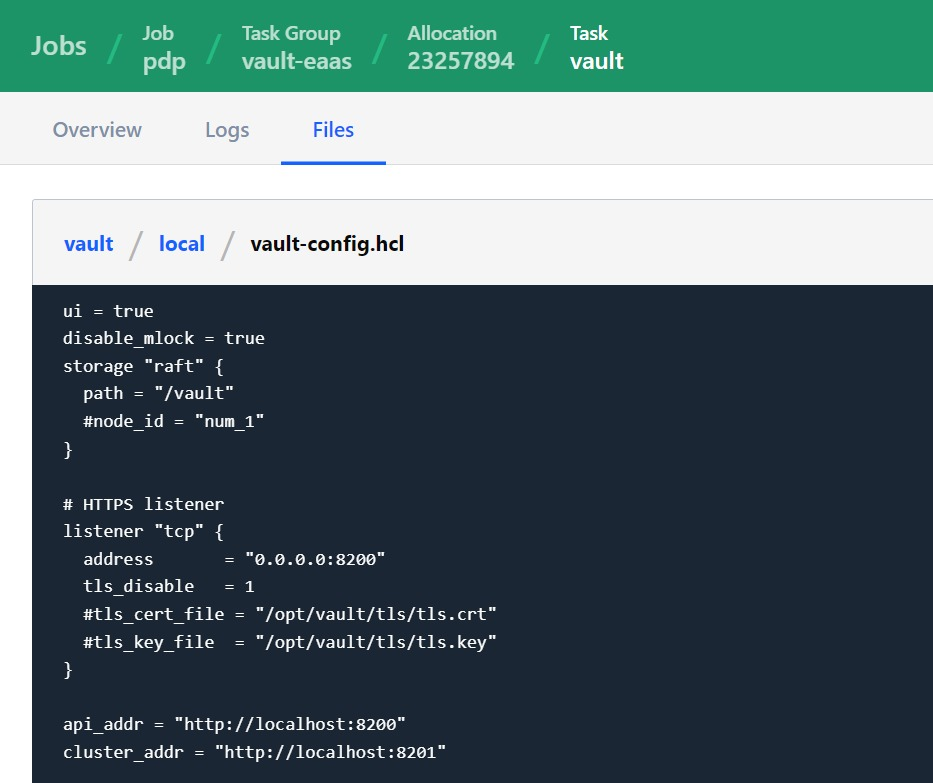

# HashiCorp_Nomad
All about HashiCorp Nomad

## Information
This configuration for orchestrate Docker. Must install Docker first before use it.<br>
This container base deployment using mounting volume so its data persistent.<br>
Need to add plugin docker for orchestrate Docker and client block host_volume on nomad.hcl<br>

## Useful Command
Deploy Nomad Job
```
  nomad job run yourNomadJob.hcl
```

Execute Nomad container
```
  nomad exec allocID linuxCommand
```

## Screenshot
**Docker container volume mounted**


**Nomad configuration successfully inject vault configuration**

